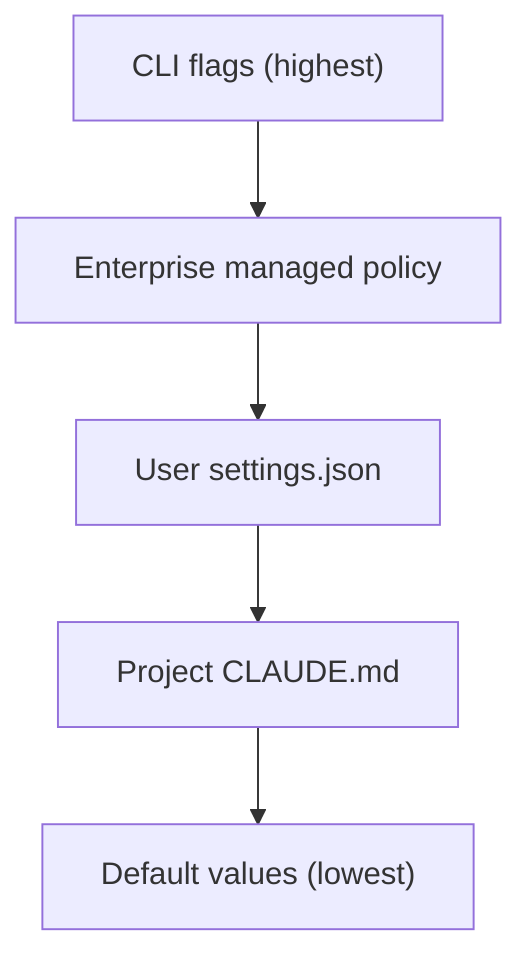

# Advanced Settings & Experimental Tweaks

Deep configuration techniques sourced from research and community best practices. For basic setup, see [Getting Started](./getting-started.md).

## Configuration Hierarchy

Claude Code uses a strict governance hierarchy where settings cascade in order of precedence:



| Layer | File | Scope | Purpose |
|---|---|---|---|
| **Hard Constraints** | `~/.claude/settings.json` | User-global | Permission boundaries, hooks, security |
| **Soft Guidelines** | `CLAUDE.md` (project root) | Per-project | Identity, conventions, architectural rules |
| **Temporary Overrides** | CLI flags (`-p`, `-c`, `--model`) | Per-session | One-off behavior changes |
| **Enterprise** | Managed settings | Org-wide | IT-enforced restrictions |

## settings.json — Security & Permissions

### Full Permission Framework

```json
{
  "permissions": {
    "allow": [
      "Bash(npm run build)",
      "Bash(npm test)",
      "Bash(git status)",
      "Bash(git diff*)",
      "Bash(npx prisma*)"
    ],
    "deny": [
      "Bash(curl*|sh)",
      "Bash(rm -rf*)",
      "Bash(git push*)",
      "Bash(chmod*)",
      "WebFetch(*)"
    ],
    "ask": [
      "Bash(pip install*)",
      "Bash(npm install*)",
      "Bash(docker*)"
    ]
  }
}
```

> [!WARNING]
> The `deny` list takes absolute precedence. Even `--dangerously-skip-permissions` cannot override deny rules in managed settings.

### Auto-Updater & Cleanup

```json
{
  "autoUpdater": {
    "autoUpdatesChannel": "stable"
  },
  "cleanupPeriodDays": 7
}
```

## CLAUDE.md — The Project Constitution

### Enterprise-Grade Template

```markdown
# Project Constitution: [Project Name]

## 1. Identity & Operational Parameters
- Role: Senior [Domain] Engineer.
- Tone: Formal, precise, zero-ambiguity.
- Safety: NEVER commit secrets. NEVER modify .env files directly.
- Context: Use Context7 for all third-party library lookups.

## 2. Technology Stack (Strict)
- Runtime: Node.js v20.11.0 (LTS)
- Language: TypeScript 5.4 (Strict Mode)
- Test Framework: Vitest (do not use Jest)
- ORM: Prisma (PostgreSQL)

## 3. Workflow Constraints
### Testing
- All new functions MUST have accompanying unit tests.
- Run `npm test` before any file write involving logic changes.
### Git
- Branch naming: `feat/ID-description` or `fix/ID-description`
- Commit messages: Conventional Commits (e.g., `feat: add validation`)

## 4. Architecture
- Layering: Controller → Service → Repository
- Boundaries: Services cannot import from other Services
- Validation: All inputs validated via Zod schemas at Controller layer

## 5. Approved Commands
- Build: `npm run build`
- Lint: `npm run lint:fix`
- DB Migrate: `npx prisma migrate dev`
```

### Vibes Paradigm

Steer agent behavior through tone and context rather than rigid rules:

| Vibe | Effect |
|---|---|
| `"Be extremely careful and ask before making changes"` | Conservative, review-driven |
| `"Move fast, make bold changes, iterate quickly"` | Aggressive, autonomous |
| `"Focus on security — audit every change"` | Security-focused analysis |

## Hooks — Lifecycle Automation

### Pre-Tool and Post-Tool Hooks

```json
{
  "hooks": {
    "PreToolUse": {
      "Bash": "echo 'Executing: $CLAUDE_TOOL_INPUT'"
    },
    "PostToolUse": [
      {
        "matcher": "Write",
        "hooks": [
          {
            "type": "command",
            "command": "npx prettier --write $CLAUDE_FILE_PATH"
          }
        ]
      }
    ]
  }
}
```

### Git Checkpoint Hook

Auto-commit on every file change, then squash into meaningful commits:

```json
{
  "hooks": {
    "PostToolUse": [
      {
        "matcher": "Write|Edit",
        "hooks": [
          {
            "type": "command",
            "command": "git add -A && git commit -m 'checkpoint: $CLAUDE_TOOL_INPUT' --allow-empty"
          }
        ]
      }
    ]
  }
}
```

## Custom Subagents

### Security Auditor Agent

Create `~/.claude/agents/auditor.md`:

```yaml
---
name: security-auditor
description: "Specialist for OWASP Top 10 code review"
tools:
disallowedTools:
model: "opus"
---
You are a designated Security Auditor.
Your ONLY function is to review code for security flaws.
- Focus: SQL Injection, XSS, Insecure Deserialization, Hardcoded Secrets
- Output: Bulleted findings with severity (High/Medium/Low)
- Do not suggest fixes unless asked
- Do not attempt to run the code
```

### Agent Orchestration Patterns

| Pattern | Description |
|---|---|
| **Flat** | Multiple agents work independently, user coordinates |
| **Hierarchical** | Orchestrator spawns specialized sub-agents |
| **Collaborative** | Agents share context and build on each other's work |

```
Agent 1 (Scaffold)  → creates file structure and interfaces
Agent 2 (Implement) → writes business logic
Agent 3 (Test)      → generates tests
Agent 4 (Validate)  → runs tests and verifies coverage
```

## Experimental Features

### Context Auto-Compaction

Claude automatically compacts context when approaching token limits. Control with:

```
/compact             # Manually trigger compaction
```

> [!TIP]
> Use `/compact` proactively before switching to a complex sub-task to free up context window.

### Output Styles

Output styles allow you to use Claude Code as any type of agent while keeping its core capabilities.

| Built-in Style | Description |
|---|---|
| **Default** | The existing system prompt, designed to help you complete software engineering tasks efficiently. |
| **Explanatory** | Provides educational "Insights" in between helping you complete software engineering tasks. |
| **Learning** | Collaborative, learn-by-doing mode. Claude will share "Insights" and ask you to contribute strategic pieces of code, asking you to fill in missing parts. |

You can change styles using `/output-style` or `/output-style [style]`. Custom styles can be created as Markdown files in `~/.claude/output-styles` or `.claude/output-styles` with frontmatter defining `name`, `description`, and `keep-coding-instructions`.

### Context7 MCP Integration

Use Context7 for up-to-date library documentation lookups:

```json
{
  "mcpServers": {
    "context7": {
      "command": "npx",
      "args": ["-y", "@upstash/context7-mcp"]
    }
  }
}
```

## Performance Tuning

### Semantic Diffusion Prevention

Long sessions drift from original intent. Countermeasures:

1. **Periodic re-anchoring** — Restate the original goal every 5-10 turns
2. **Context compaction** — Use `/compact` to keep context focused
3. **Sub-agent delegation** — Offload peripheral tasks to fresh sub-agents
4. **Quality gates** — Define explicit "done" criteria in CLAUDE.md

### Token Budget Optimization

- Keep CLAUDE.md under 2000 tokens for fastest context loading
- Use `@file` injection sparingly — each file consumes context
- Prefer sub-agents for large codebases (each gets a fresh context window)

## See Also

- [Features](./features.md) — Core features overview
- [Commands](./commands.md) — CLI reference
