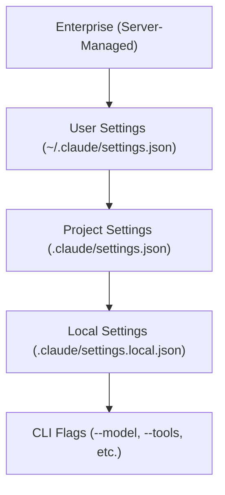

# Advanced Usage & Configuration

This guide covers configuration, model selection, IDE integrations, cloud providers, and deployment options for Claude Code.

## Configuration Scopes

Claude Code uses a layered settings system. More specific scopes override broader ones:



> [!IMPORTANT]
> Enterprise administrators can enforce settings via [Server-Managed Settings](https://code.claude.com/docs/en/server-managed-settings). These take the highest precedence and cannot be overridden locally.

### Settings File Locations

| Scope | Path | Committed to Git? |
|---|---|---|
| User | `~/.claude/settings.json` | No |
| Project | `.claude/settings.json` | Yes |
| Local | `.claude/settings.local.json` | No (gitignored) |
| Enterprise | Managed remotely | N/A |

Edit settings interactively with the `/config` slash command.

## Model Configuration

Set the model per-session or in your settings:

```bash
claude --model claude-sonnet-4-6
claude --model opus
```

Available model aliases: `sonnet`, `opus`, `haiku`.

> [!TIP]
> Use `--fallback-model` in print mode to automatically switch models when the primary is overloaded: `claude -p --fallback-model sonnet "query"`

## Cloud Providers

Claude Code supports third-party model providers for enterprise or custom deployments:

| Provider | Documentation |
|---|---|
| Amazon Bedrock | [Setup Guide](https://code.claude.com/docs/en/amazon-bedrock) |
| Google Vertex AI | [Setup Guide](https://code.claude.com/docs/en/google-vertex-ai) |
| Microsoft Foundry | [Setup Guide](https://code.claude.com/docs/en/microsoft-foundry) |
| LLM Gateway | [Configuration](https://code.claude.com/docs/en/llm-gateway) |

## IDE Integrations

Claude Code integrates with major editors beyond the terminal:

| Integration | Link |
|---|---|
| VS Code Extension | [Setup](https://code.claude.com/docs/en/vs-code) |
| JetBrains Plugin | [Setup](https://code.claude.com/docs/en/jetbrains) |
| Chrome Extension (beta) | [Setup](https://code.claude.com/docs/en/chrome) |
| Desktop App | [Quickstart](https://code.claude.com/docs/en/desktop-quickstart) |
| Claude Code on the Web | [Overview](https://code.claude.com/docs/en/claude-code-on-the-web) |

## CI/CD Integration

Use Claude Code in automated pipelines:

- [GitHub Actions](https://code.claude.com/docs/en/github-actions)
- [GitLab CI/CD](https://code.claude.com/docs/en/gitlab-ci-cd)
- [Slack Integration](https://code.claude.com/docs/en/slack)

### Headless / Non-Interactive Mode

For scripting and automation, use print mode (`-p`) with structured output:

```bash
claude -p --output-format json "analyze this codebase" > report.json
```

Control budget and turns:

```bash
claude -p --max-budget-usd 5.00 --max-turns 10 "refactor the auth module"
```

See the [Headless documentation](https://code.claude.com/docs/en/headless).

## Network Configuration

Configure proxy settings, custom certificates, and network restrictions. See [Network Config](https://code.claude.com/docs/en/network-config).

## DevContainers

Run Claude Code inside VS Code DevContainers or GitHub Codespaces. See [DevContainer Setup](https://code.claude.com/docs/en/devcontainer).

## Updates & Release Channels

Native installations auto-update. Control the release channel:

```json
{
  "autoUpdatesChannel": "stable"
}
```

| Channel | Behavior |
|---|---|
| `latest` (default) | New features as soon as released |
| `stable` | ~1 week delay, skips releases with regressions |

Disable auto-updates by setting `DISABLE_AUTOUPDATER` to `"1"` in your `env` config.

## See Also

- [Settings Reference](https://code.claude.com/docs/en/settings)
- [Memory](https://code.claude.com/docs/en/memory) — CLAUDE.md project context
- [Permissions](https://code.claude.com/docs/en/permissions)
- [Monitoring Usage](https://code.claude.com/docs/en/monitoring-usage)
