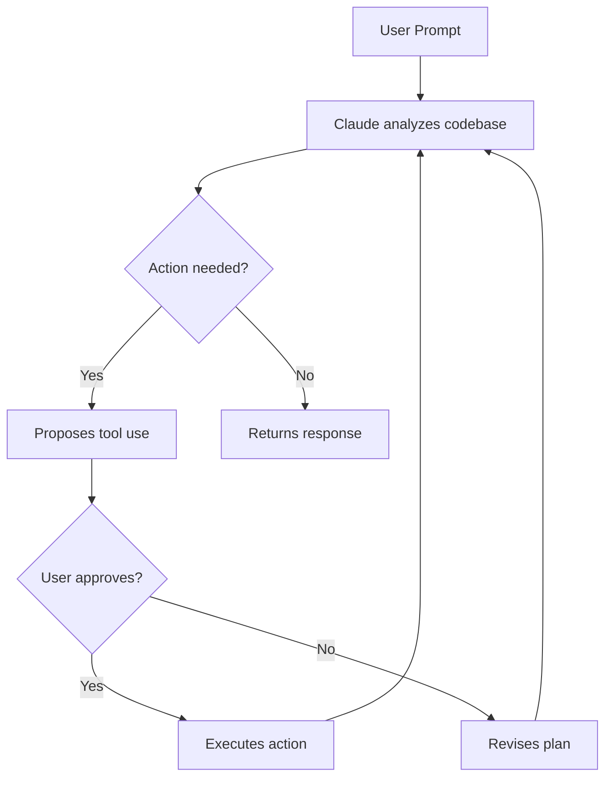

# Agentic Features

Claude Code is not a passive code suggestion tool — it is a fully agentic assistant that reads files, runs commands, and spawns specialized sub-agents to accomplish complex tasks.

## How the Agentic Loop Works



Claude Code iterates through a **plan → act → observe** loop. It reads your files, proposes changes, asks for approval, and then executes — repeating until the task is complete. See [How Claude Code Works](https://code.claude.com/docs/en/how-claude-code-works) for a deep dive.

## Sub-Agents

Sub-agents are specialized Claude instances that the main agent can spawn to handle specific tasks in parallel. Each sub-agent has its own prompt, tool access, and model configuration.

### Built-in Sub-Agents

Claude Code ships with pre-configured sub-agents for common workflows. List them with:

```bash
claude agents
```

### Custom Sub-Agents

Define custom sub-agents via `--agents` on the command line or in your project's configuration:

```bash
claude --agents '{
  "code-reviewer": {
    "description": "Expert code reviewer. Use proactively after code changes.",
    "prompt": "You are a senior code reviewer. Focus on quality, security, and best practices.",
    "tools": ["Read", "Grep", "Glob", "Bash"],
    "model": "sonnet"
  }
}'
```

For persistent configuration, see the [Sub-Agents documentation](https://code.claude.com/docs/en/sub-agents).

## Agent Teams

Agent Teams enable multiple Claude instances to collaborate on a single task. One session acts as the team lead, coordinating work, assigning tasks, and synthesizing results. Teammates work independently, each in its own context window, and communicate directly with each other.

> [!NOTE]
> Agent Teams are experimental and disabled by default. Enable them by setting `enableAgentTeams: true` in your configuration or environment. Use `--teammate-mode` to control how teammates display: `auto` (default), `in-process`, or `tmux`.

Agent teams are most effective for tasks where parallel exploration adds real value. They add coordination overhead and use significantly more tokens than a single session. They work best when teammates can operate independently. For sequential tasks or same-file edits, a single session or sub-agents may be more appropriate.

## Hooks

Hooks let you run custom scripts at specific points in Claude Code's lifecycle — before/after tool execution, on session start, and more.

```bash
claude --init          # Run initialization hooks and start
claude --init-only     # Run initialization hooks, then exit
claude --maintenance   # Run maintenance hooks, then exit
```

See the [Hooks Guide](https://code.claude.com/docs/en/hooks-guide) and [Hooks Reference](https://code.claude.com/docs/en/hooks) for configuration details.

## Model Context Protocol (MCP)

MCP lets you extend Claude Code with additional tools and data sources from third-party servers.

```bash
claude mcp                             # Manage MCP servers
claude --mcp-config ./my-mcp.json      # Load MCP config from file
```

> [!TIP]
> Use `--strict-mcp-config` to only load MCP servers from the specified config file, ignoring all other MCP configurations.

See the [MCP documentation](https://code.claude.com/docs/en/mcp) for setup and server configuration.

## Skills

Skills are reusable prompt templates that Claude loads on demand. They appear as slash commands in the interactive session.

```text
/  — View all available skills and slash commands
```

Disable all skills for a session with `--disable-slash-commands`. See the [Skills documentation](https://code.claude.com/docs/en/skills).

## Checkpointing

Claude Code automatically creates Git checkpoints so you can review and revert changes safely. See the [Checkpointing documentation](https://code.claude.com/docs/en/checkpointing).

## Remote Control

Start a Remote Control session to drive Claude Code from [claude.ai](https://claude.ai) or the Claude desktop app while it runs locally on your machine:

```bash
claude remote-control
```

See the [Remote Control documentation](https://code.claude.com/docs/en/remote-control).

## Plugins

Plugins extend Claude Code with new tools, integrations, and capabilities:

- [Plugins Overview](https://code.claude.com/docs/en/plugins)
- [Discover Plugins](https://code.claude.com/docs/en/discover-plugins)
- [Plugin Marketplaces](https://code.claude.com/docs/en/plugin-marketplaces)
- [Plugins Reference](https://code.claude.com/docs/en/plugins-reference)

## See Also

- [Features Overview](https://code.claude.com/docs/en/features-overview)
- [Best Practices](https://code.claude.com/docs/en/best-practices)
- [Interactive Mode](https://code.claude.com/docs/en/interactive-mode)
