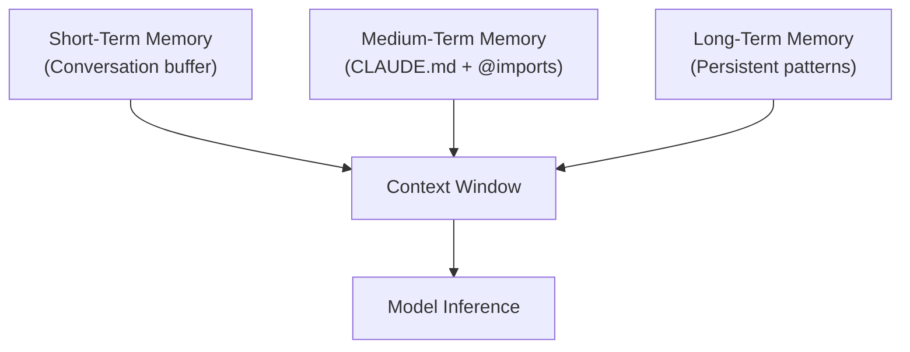
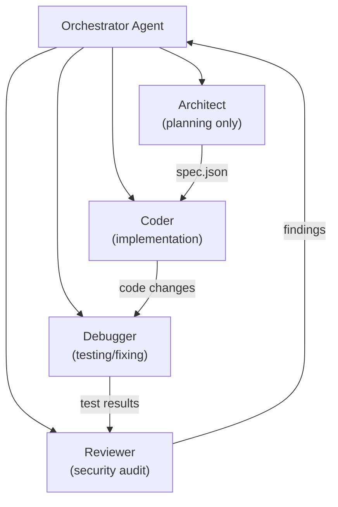

# Experimental Settings & Research-Based Tweaks

> [!WARNING]
> These techniques are sourced from deep research, community experiments, and cutting-edge patterns. They may change, break, or require specific versions. Use at your own risk.

## Context Engineering

### Memory Architecture

Claude Code operates with three memory tiers:



| Tier | Mechanism | Persistence | Capacity |
|---|---|---|---|
| **Short-term** | Conversation context | Session-only | ~200k tokens |
| **Medium-term** | CLAUDE.md + file imports | Project-scoped | ~10k tokens recommended |
| **Long-term** | Learned patterns via `/compact` | Across sessions | Model-dependent |

### Context Window Survival Strategies

For large codebases (200k+ tokens):

1. **Selective file injection** — Only `@import` files relevant to the current task
2. **Summary layers** — Create `docs/architecture-summary.md` that agents read instead of full source
3. **Agent partitioning** — Have each sub-agent own a specific module, never the full repo
4. **Compaction cadence** — Run `/compact` every 15-20 turns to prevent context overflow

### Contextual Retrieval Pattern

```markdown
# CLAUDE.md — RAG-Style Context Loading

## @imports (loaded at startup)
@./docs/api-spec.md
@./docs/database-schema.md
@./CHANGELOG.md

## Dynamic Loading Instructions
When working on authentication, also read:
- src/auth/middleware.ts
- src/auth/tokens.ts

When working on database:
- src/db/migrations/
- src/db/models/
```

> [!TIP]
> Use conditional `@import` instructions so the agent loads files on-demand rather than at startup.

## Multi-Agent Orchestration Patterns

### Hierarchical Agent Architecture



### Agent Definitions

Create specialized agents at `~/.claude/agents/`:

**Architect** (`~/.claude/agents/architect.md`):
```yaml
---
name: architect
description: "Plans implementation approach. NEVER writes code."
model: "opus"
disallowedTools: ["Write", "Edit", "Bash"]
---
You are a Software Architect. Produce ONLY:
1. Component breakdown with dependencies
2. Interface definitions (TypeScript interfaces)
3. Data flow diagram (Mermaid)
4. Risk assessment
NEVER write implementation code.
```

**Coder** (`~/.claude/agents/coder.md`):
```yaml
---
name: coder
description: "Implements code from architect specs."
model: "sonnet"
---
You implement code EXACTLY matching the architect's spec.
- Follow the interface contracts precisely
- Write unit tests for every public function
- Use the project's coding conventions from CLAUDE.md
```

**Security Auditor** (`~/.claude/agents/security-auditor.md`):
```yaml
---
name: security-auditor
description: "OWASP Top 10 security review."
model: "opus"
disallowedTools: ["Write", "Edit", "Bash"]
---
Review code for:
- SQL Injection, XSS, CSRF
- Insecure deserialization
- Hardcoded secrets
- Broken access control
Output: Severity-rated findings (Critical/High/Medium/Low)
```

### Quality Gate Pattern

```
Orchestrator spawns Coder
  → Coder produces code
  → Orchestrator spawns Reviewer
  → Reviewer checks code
  → If issues found → Orchestrator sends back to Coder
  → If clean → Orchestrator marks complete
```

Define explicit completion signals in agent instructions:
```
When your task is complete, output exactly:
TASK_COMPLETE: <summary of what was done>
```

### Context Isolation Between Agents

Each sub-agent gets a **fresh context window**. To share state:

1. **File-based handoff** — Agent A writes `task-report.json`, Agent B reads it
2. **Structured output** — Use JSON schemas for inter-agent communication
3. **Shared CLAUDE.md** — All agents inherit the project constitution

> [!IMPORTANT]
> Sub-agents do NOT inherit the parent's conversation history. Design handoffs explicitly via files.

## Semantic Diffusion Prevention

Long sessions lose focus. Research-backed countermeasures:

### Anchor Pattern

Add to CLAUDE.md:
```markdown
## Task Anchors
Before EVERY response, re-read this section.
Current sprint goal: [specific goal]
Forbidden changes: [list of files/patterns to never touch]
Quality bar: [specific metrics]
```

### Checkpoint-and-Reanchor

```
Every 10 turns:
1. /compact (summarize history)
2. Re-read CLAUDE.md (reloads anchors)
3. State current progress against original goal
```

### Constitutional AI Guardrails

Embed self-checking in CLAUDE.md:
```markdown
## Self-Check Rules
Before completing any task:
1. Does my output match the original request?
2. Did I modify ONLY the files specified?
3. Are there any hardcoded secrets in my changes?
4. Do all tests pass?
If ANY answer is "no", stop and explain.
```

## Experimental CLI Features

### Extended Thinking

```bash
claude --model opus --thinking         # Enable extended reasoning
```

Extended thinking provides chain-of-thought reasoning before producing output. Best for:
- Complex architectural decisions
- Bug analysis with multiple potential causes
- Security vulnerability analysis

### Prompt Caching

Reduce API costs for repeated context:

```bash
claude -c                              # Continue last session (reuses context)
claude --resume                        # Resume a specific session
```

> [!NOTE]
> Prompt caching automatically engages when session context overlaps with previous turns. No manual configuration needed.

### Headless Mode for CI/CD

```bash
claude -p "Run tests and fix failures" --output-format json > results.json
echo "Fix auth module" | claude -p -   # Pipe prompts
```

### MCP Experimental Servers

Community MCP servers for experimental workflows:

| Server | Purpose | Install |
|---|---|---|
| **Context7** | Library docs lookup | `npx -y @upstash/context7-mcp` |
| **Sequential Thinking** | Step-by-step reasoning | `npx -y @modelcontextprotocol/server-sequential-thinking` |
| **Filesystem** | Sandboxed file access | `npx -y @modelcontextprotocol/server-filesystem` |
| **Browser** | Web page interaction | `npx -y @anthropic-ai/mcp-server-browser` |

## Performance Profiling

### Token Usage Monitoring

Track context consumption patterns:

```
/compact                # See how much context is freed
```

### Agent Efficiency Metrics

When running multi-agent workflows, track:

| Metric | Healthy Range | Concern |
|---|---|---|
| Turns per task | 5-15 | > 20 = semantic drift |
| Context at compaction | 60-80% full | > 90% = risk of truncation |
| Sub-agent spawns | 1-3 per task | > 5 = over-decomposition |
| File reads per turn | 1-3 | > 5 = thrashing (add more context) |

## See Also

- [Advanced Settings](./advanced-settings.md) — Production-ready configuration
- [Features](./features.md) — Core features
- [Commands](./commands.md) — CLI reference
