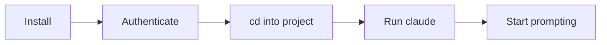

# Getting Started with Claude Code

Claude Code is Anthropic's agentic coding assistant for the terminal. It reads, edits, and runs code directly on your machine while you review each action.

## Prerequisites

Before you begin, ensure you have:

- **A terminal** — Bash, Zsh, PowerShell, or CMD. [New to the terminal?](https://code.claude.com/docs/en/terminal-guide)
- **A code project** to work in.
- **A Claude subscription** — Pro, Max, Teams, or Enterprise. You can also use a [Claude Console](https://console.anthropic.com) account or a [third-party cloud provider](https://code.claude.com/docs/en/third-party-integrations).

> [!IMPORTANT]
> The free Claude.ai plan does **not** include Claude Code access. A paid subscription is required.

## System Requirements

| Requirement | Details |
|---|---|
| **OS** | macOS 13.0+, Windows 10 1809+, Ubuntu 20.04+, Debian 10+, Alpine 3.19+ |
| **RAM** | 4 GB minimum |
| **Network** | Internet connection required |
| **Shell** | Bash, Zsh, PowerShell, or CMD. Windows requires [Git for Windows](https://gitforwindows.org) |

## Installation

### Native Install (Recommended)

Native installations auto-update in the background.

**macOS / Linux / WSL:**

```bash
curl -fsSL https://claude.ai/install.sh | bash
```

**Windows PowerShell:**

```powershell
irm https://claude.ai/install.ps1 | iex
```

**Windows CMD:**

```cmd
curl -fsSL https://claude.ai/install.cmd -o install.cmd && install.cmd && del install.cmd
```

### Homebrew (macOS / Linux)

```bash
brew install --cask claude-code
```

> [!NOTE]
> Homebrew does **not** auto-update. Run `brew upgrade claude-code` periodically.

### WinGet (Windows)

```powershell
winget install Anthropic.ClaudeCode
```

### npm Installation (Deprecated)
npm installation is deprecated. The native installer is faster, requires no dependencies, and auto-updates in the background. Use the native installation instead. If you previously installed Claude Code with npm, you can switch to the native installer:

```bash
curl -fsSL https://claude.ai/install.sh | bash
npm uninstall -g @anthropic-ai/claude-code
```

### Verify Installation

```bash
claude --version
claude doctor        # Full diagnostic check
```

## Authentication

After installing, start Claude Code and follow the browser prompts to log in:

```bash
claude
```

You can authenticate with:

- **Claude Pro / Max / Teams / Enterprise** (recommended)
- **Claude Console** (API access with pre-paid credits)
- **Amazon Bedrock**, **Google Vertex AI**, or **Microsoft Foundry**

Once logged in, credentials are stored locally. To switch accounts later, use `/login`.

## Your First Session



1. **Open your terminal** in a project directory:

   ```bash
   cd /path/to/your/project
   claude
   ```

2. **Ask a question** to explore the codebase:

   ```text
   what does this project do?
   ```

3. **Make a code change** — Claude will show proposed edits and ask for approval:

   ```text
   add input validation to the signup form
   ```

4. **Use Git conversationally:**

   ```text
   commit my changes with a descriptive message
   ```

> [!TIP]
> Claude Code reads your project files automatically — you don't need to manually add context.

## Essential Commands

| Command | Description |
|---|---|
| `claude` | Start an interactive session |
| `claude "task"` | Start a session with an initial prompt |
| `claude -p "query"` | Run a one-off query (print mode), then exit |
| `claude -c` | Continue the most recent conversation |
| `claude -r` | Resume a previous session |
| `claude commit` | Create a Git commit |
| `/clear` | Clear conversation history |
| `/help` | Show available commands |
| `exit` or `Ctrl+C` | Exit Claude Code |

## Pro Tips for Beginners

- **Be specific** — Instead of "fix the bug", try "fix the login bug where users see a blank screen after wrong credentials".
- **Break complex tasks into steps** — Give numbered instructions for multi-part work.
- **Let Claude explore first** — Ask Claude to analyze the codebase before making changes.
- **Use shortcuts** — Press `?` for all keyboard shortcuts, `Tab` for command completion, `↑` for history.

## What's Next?

- [How Claude Code Works](https://code.claude.com/docs/en/how-claude-code-works) — The agentic loop, built-in tools, and project interaction model
- [Best Practices](https://code.claude.com/docs/en/best-practices) — Effective prompting and project setup
- [Common Workflows](https://code.claude.com/docs/en/common-workflows) — Step-by-step guides for everyday tasks
- [CLI Reference](https://code.claude.com/docs/en/cli-reference) — Complete command and flag documentation
